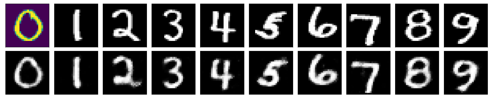

AutoEncoder
==

# Overview
AutoEncoderを使用して、画像を生成する

# Description
mnistなどのデータセットを用いて、AutoEncoderで画像生成を行う  
現在、AutoEncoderとVAEが使える  

# Requirement
新たにinstallするものはないため、[README.md](../README.md)を参照

# Usage
## Build Network
[/CNN/README.md](../CNN/README.md)を参考に作成  
注意点：

## Learning
```bash
$ cd tensorflow
$ python AutoEncoder/train.py --data (データ名) \
                              --network (ネットワーク名) \
                              --n_epoch (学習回数) \
                              --batch_size (batch size) \
                              --lr (学習率) \
                              --opt (optimizer) \
                              --aug (augmentationの種類) \
                              --checkpoints_to_keep \
                              --keep_checkpoint_every_n_hours \
                              --save_checkpoint_steps
```

# Sample Result
## AutoEncoder
上 : 入力画像, 下 : 出力画像


## VAE
上 : 入力画像, 下 : 出力画像