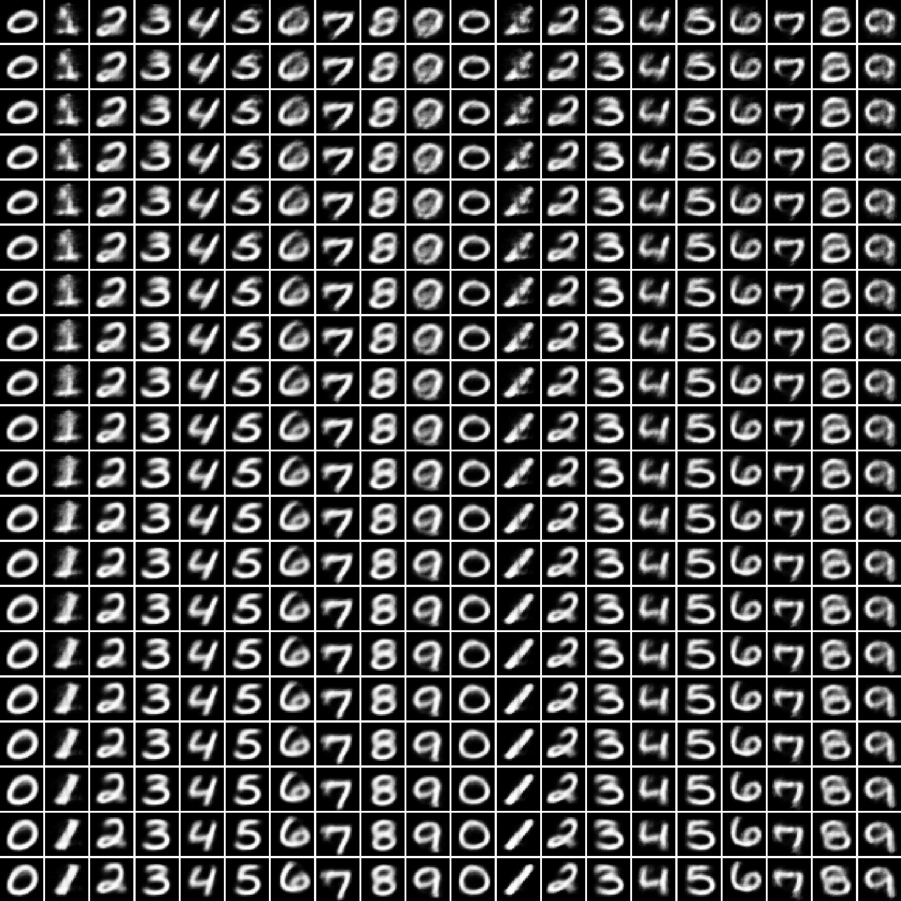

AutoEncoder
--
# AutoEncoder
```bash
$ python train.py --network AutoEncoder --opt Adam
```


# Variational AutoEncoder(VAE)
```bash
$ python train.py --network VAE --opt Adam
```


# Conditional Variational AutoEncoder(CVAE)
```bash
$ python train.py --network CVAE --opt Adam
```
