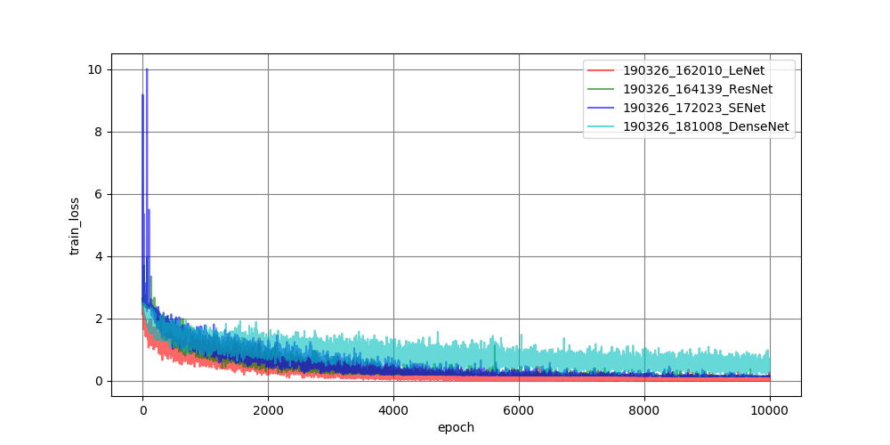
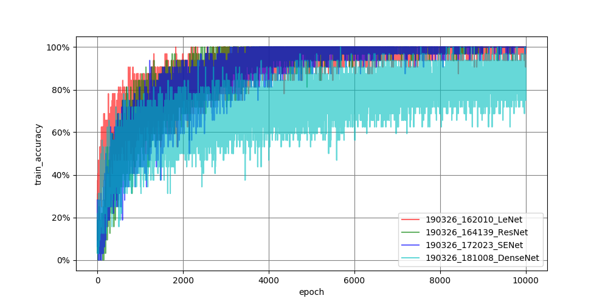
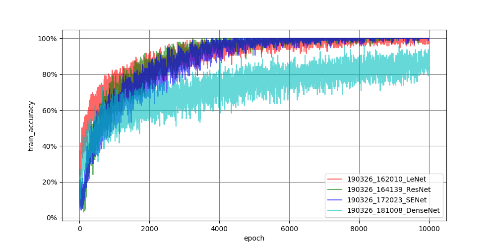
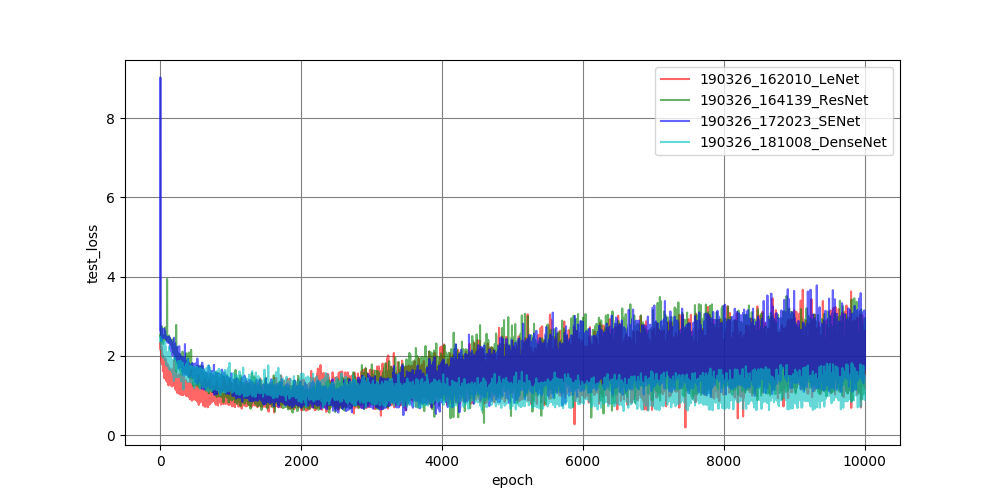
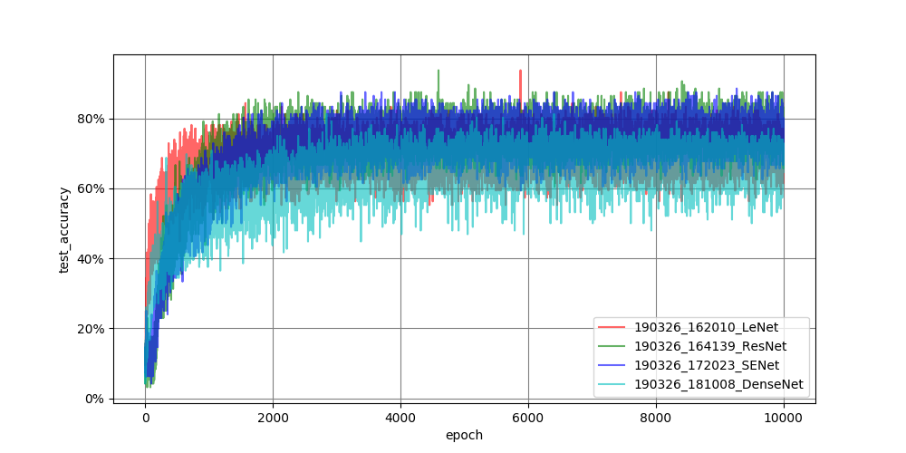
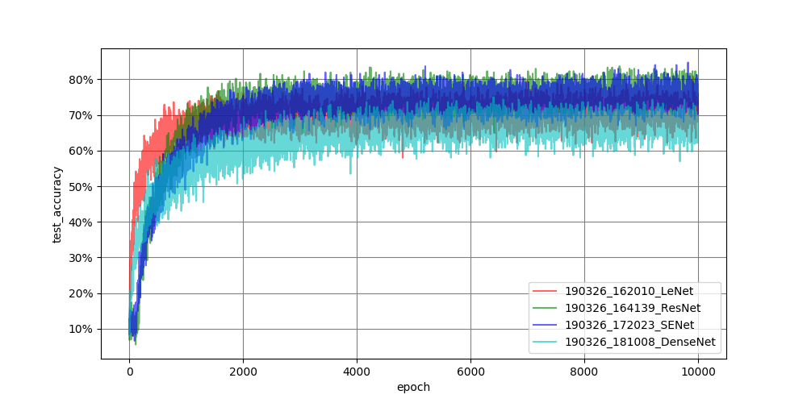

CNN
====

# Overview
tensorflowの練習用  
使用するデータはmnistやcifarを想定

# Description
- [2018年風TensorFlowでの学習処理の記述方法](http://ksksksks2.hatenadiary.jp/entry/20181008/1538994843)にある```MoniteredTrainedSession```や```tf.data```などの使い方を学ぶため、mnistやcifarを用いて、プログラムを作成する
- Eager Modeを使用するよりも、sessionを立てる方(train.py)が計算が早いです

# Requirement
新たにinstallするものはないため、[README.md](../README.md)を参照

# Usage
## Build Network
LeNetの他に、  
```train.py```内にある```set_model```関数に作成したいモデルを定義する  
listである**model_set**にlayerごとの情報をlistとしてappendする  
定義の方法は以下の通り  
### 基本設計：[`layer種類`,`args`]
#### argsの設計
| layer | args | 
|:-----------:|:-----------:|
| fc | [units, activation] |
| dropout | [units, activation, rate] | 
| ReLU | [] |
| Leaky_ReLU | [] |
| tanh | [] |
| sigmoid | [] |
| conv | [kernel, filter, strides, activation] |
| deconv | [kernel, filter, strides, activation] |
| Residual | [kernel, filter, strides, bottleneck, No] |
| max_pool | [pool_size, strides] |
| avg_pool | [pool_size, strides] |
| BN | [] |
| gap | [] |
詳細は[module.py](https://github.com/KNakane/tensorflow/blob/master/network/module.py)参照のこと

### Related Network
上記はネットワークを自ら構築する必要があるが、すでに開発済みの以下のネットワークは構築せずとも使える（但し、学習済パラメータはなし）
- ResNet
- ResNext
- SENet
- DenseNet  
以上は引数の```--network```で呼び出せば使うことが出来る

### Example
```
def set_model(outdim):
    model_set = [['conv', 5, 32, 1],
                 ['max_pool', 2, 2],
                 ['conv', 5, 64, 1],
                 ['max_pool', 2, 2],
                 ['dropout', 1024, tf.nn.relu, 0.5],
                 ['fc', outdim, None]]
    return model_set
```


## Learning
```bash
$ cd tensorflow
$ python CNN/train.py --data (データ名) \
                      --network (ネットワーク名) \
                      --n_epoch (学習回数) \
                      --batch_size (batch size) \
                      --lr (学習率) \
                      --opt (optimizer) \
                      --aug (augmentationをするかしないか) \
                      --checkpoints_to_keep \
                      --keep_checkpoint_every_n_hours \
                      --save_checkpoint_steps
```
## Test
```
$ python CNN/eval.py --ckpt_dir (checkpoint保存directory) \
                     --network (ネットワーク名) \
                     --data (データ名)
```

## Tensorboard
```
$ tensorboard --logdir=/path/to/logdir
```
 
# Sample Result
## cifar10
|種類|グラフ||
|:--:|:--:|:--:|
|train_loss||
|train_accuracy||
|train_accuracy_moving_avg||
|test_loss||
|test_accuracy||
|test_accuracy_moving_avg||
## kuzushiji-mnist
