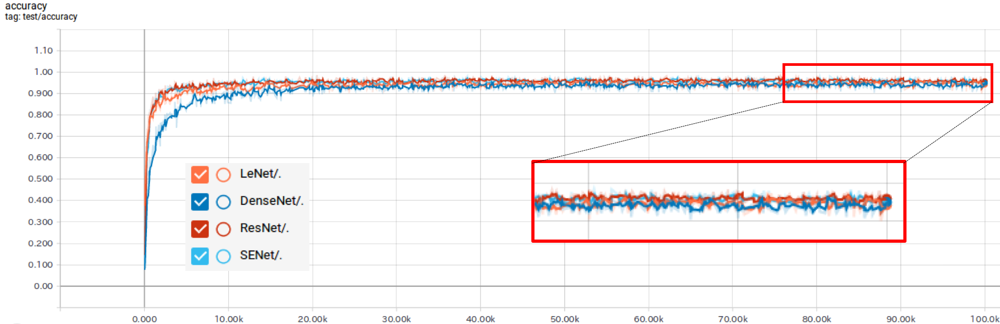

CNN
====

# Overview
tensorflowの練習用  
使用するデータはmnistやcifarを想定

# Description
- [2018年風TensorFlowでの学習処理の記述方法](http://ksksksks2.hatenadiary.jp/entry/20181008/1538994843)にある```MoniteredTrainedSession```や```tf.data```などの使い方を学ぶため、mnistやcifarを用いて、プログラムを作成する
- Eager Modeを使用するよりも、sessionを立てる方(train.py)が計算が早いです

# Requirement
新たにinstallするものはないため、[README.md](../README.md)を参照

# Usage
## Build Network
LeNetの他に、  
```train.py```内にある```set_model```関数に作成したいモデルを定義する  
listである**model_set**にlayerごとの情報をlistとしてappendする  
定義の方法は以下の通り  
### 基本設計：[`layer種類`,`args`]
#### argsの設計
| layer | args | 
|:-----------:|:-----------:|
| fc | [units, activation] |
| dropout | [units, activation, rate] | 
| ReLU | [] |
| Leaky_ReLU | [] |
| tanh | [] |
| sigmoid | [] |
| conv | [kernel, filter, strides, activation] |
| deconv | [kernel, filter, strides, activation] |
| Residual | [kernel, filter, strides, bottleneck, No] |
| max_pool | [pool_size, strides] |
| avg_pool | [pool_size, strides] |
| BN | [] |
| gap | [] |
詳細は[module.py](https://github.com/KNakane/tensorflow/blob/master/network/module.py)参照のこと

### Related Network
上記はネットワークを自ら構築する必要があるが、すでに開発済みの以下のネットワークは構築せずとも使える（但し、学習済パラメータはなし）
- ResNet
- ResNext
- SENet
- DenseNet  
以上は引数の```--network```で呼び出せば使うことが出来る

### Example
```
def set_model(outdim):
    model_set = [['conv', 5, 32, 1],
                 ['max_pool', 2, 2],
                 ['conv', 5, 64, 1],
                 ['max_pool', 2, 2],
                 ['dropout', 1024, tf.nn.relu, 0.5],
                 ['fc', outdim, None]]
    return model_set
```


## Learning
```bash
$ cd tensorflow
$ python CNN/train.py --data (データ名) \
                      --network (ネットワーク名) \
                      --n_epoch (学習回数) \
                      --batch_size (batch size) \
                      --lr (学習率) \
                      --opt (optimizer) \
                      --aug (augmentationをするかしないか) \
                      --checkpoints_to_keep \
                      --keep_checkpoint_every_n_hours \
                      --save_checkpoint_steps
```
## Test
```
$ python CNN/eval.py --ckpt_dir (checkpoint保存directory) \
                     --network (ネットワーク名) \
                     --data (データ名)
```

## Tensorboard
```
$ tensorboard --logdir=/path/to/logdir
```
 
# Sample Result
## Terminal
```bash
------Learning Details------
Network : LeNet
data : mnist
epoch : 1000
batch_size : 32
Optimizer : Adam
learning_rate : 0.001
----------------------------
INFO:tensorflow:Graph was finalized.
2019-01-09 08:38:46.580738: I tensorflow/core/platform/cpu_feature_guard.cc:141] Your CPU supports instructions that this TensorFlow binary was not compiled to use: AVX2 FMA
INFO:tensorflow:Running local_init_op.
INFO:tensorflow:Done running local_init_op.
INFO:tensorflow:Saving checkpoints for 0 into results/190109_083846_LeNet/model/model.ckpt.
INFO:tensorflow:global_step = 1, train loss = 2.3049936, train accuracy = 0.15625, test loss = 2.3102922, test accuracy = 0.104166664
INFO:tensorflow:Saving checkpoints for 100 into results/190109_083846_LeNet/model/model.ckpt.
INFO:tensorflow:global_step/sec: 25.5454
INFO:tensorflow:global_step = 101, train loss = 0.14169851, train accuracy = 0.9375, test loss = 0.49837124, test accuracy = 0.8541667 (3.915 sec)
INFO:tensorflow:Saving checkpoints for 200 into results/190109_083846_LeNet/model/model.ckpt.
INFO:tensorflow:global_step/sec: 24.0406
INFO:tensorflow:global_step = 201, train loss = 0.14052512, train accuracy = 0.90625, test loss = 0.32796296, test accuracy = 0.8958333 (4.160 sec)
INFO:tensorflow:Saving checkpoints for 300 into results/190109_083846_LeNet/model/model.ckpt.
INFO:tensorflow:global_step/sec: 20.2842
INFO:tensorflow:global_step = 301, train loss = 0.045304425, train accuracy = 1.0, test loss = 0.20235687, test accuracy = 0.9270833 (4.930 sec)
INFO:tensorflow:Saving checkpoints for 400 into results/190109_083846_LeNet/model/model.ckpt.
INFO:tensorflow:global_step/sec: 18.9074
INFO:tensorflow:global_step = 401, train loss = 0.12073513, train accuracy = 0.96875, test loss = 0.18668492, test accuracy = 0.9270833 (5.289 sec)
INFO:tensorflow:Saving checkpoints for 500 into results/190109_083846_LeNet/model/model.ckpt.
INFO:tensorflow:global_step/sec: 19.7883
INFO:tensorflow:global_step = 501, train loss = 0.053041346, train accuracy = 1.0, test loss = 0.120652616, test accuracy = 0.9479167 (5.054 sec)
INFO:tensorflow:Saving checkpoints for 600 into results/190109_083846_LeNet/model/model.ckpt.
INFO:tensorflow:global_step/sec: 19.1117
INFO:tensorflow:global_step = 601, train loss = 0.01414567, train accuracy = 1.0, test loss = 0.029330222, test accuracy = 0.9895833 (5.232 sec)
INFO:tensorflow:Saving checkpoints for 700 into results/190109_083846_LeNet/model/model.ckpt.
INFO:tensorflow:global_step/sec: 21.0739
INFO:tensorflow:global_step = 701, train loss = 0.35343158, train accuracy = 0.9375, test loss = 0.068792515, test accuracy = 0.96875 (4.745 sec)
INFO:tensorflow:Saving checkpoints for 800 into results/190109_083846_LeNet/model/model.ckpt.
INFO:tensorflow:global_step/sec: 20.199
INFO:tensorflow:global_step = 801, train loss = 0.08725928, train accuracy = 0.96875, test loss = 0.16032778, test accuracy = 0.9270833 (4.951 sec)
INFO:tensorflow:Saving checkpoints for 900 into results/190109_083846_LeNet/model/model.ckpt.
INFO:tensorflow:global_step/sec: 19.3936
INFO:tensorflow:global_step = 901, train loss = 0.14643487, train accuracy = 0.9375, test loss = 0.054370016, test accuracy = 0.9791667 (5.156 sec)
INFO:tensorflow:Saving checkpoints for 1000 into results/190109_083846_LeNet/model/model.ckpt.
INFO:tensorflow:No assets to save.
INFO:tensorflow:No assets to write.
INFO:tensorflow:SavedModel written to: results/190109_083846_LeNet/model/saved_model/saved_model.pb
```
## tensorboard
