GAN
====

# Overview
tensorflowの練習用  
使用するデータはmnistやcifarを想定  
[参考URL](https://github.com/katsugeneration/sngan-with-projection-tensorflow/tree/master/models)  
[参考](https://github.com/keiohta/tf_gans)  
[公式](https://github.com/carpedm20/DCGAN-tensorflow)

# Description
GANを用いた画像生成のプログラム  
epochごとに画像生成し、resultsに保存する  


# Requirement
新たにinstallするものはないため、[README.md](../README.md)を参照

# Usage
## Build Network
[CNN/README.md](../CNN/README.md)のBuild Networkを参照すること  
GeneratorとDiscriminatorの両方を作成する必要があり、各GANのプログラムの```build```関数に作成する必要がある。

## Learning
```
$ python GAN/train.py --network (GAN,DCGAN,CGAN)
                      --data (mnist,cifar10,cifar100,kuzushiji)
                      --n_epoch (epoch数)
                      --batch_size
                      --lr (learning rate)
                      --opt (optimizer)
                      --aug (shift,mirror,rotate,shift_rotate,cutout,random_erace)
                      --l2_norm (True / False)
                      --n_disc_update (int)
```
## Test

## Tensorboard
```
$ tensorboard --logdir=/path/to/logdir
```
 
# Sample Result
## GAN
|1回学習|25000回学習|50000回学習|100000回学習|
|:--:|:--:|:--:|:--:|
|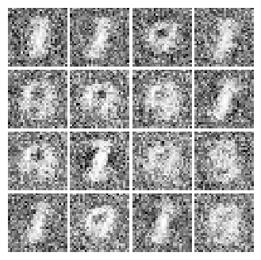|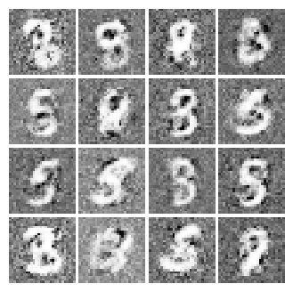|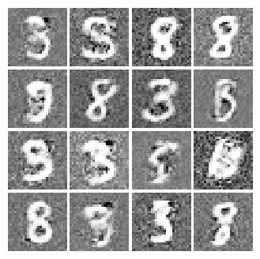|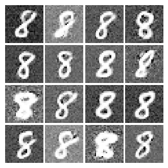|

## DCGAN
|0回学習|1000回学習|5000回学習|10000回学習|30000回学習|50000回学習|
|:--:|:--:|:--:|:--:|:--:|:--:|
|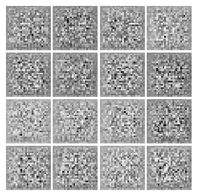|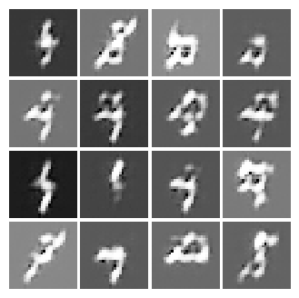||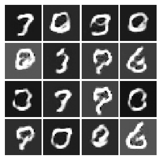|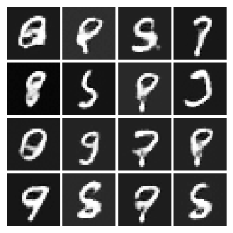|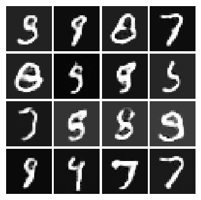|

## WGAN
|0回学習|1000回学習|5000回学習|10000回学習|30000回学習|50000回学習|
|:--:|:--:|:--:|:--:|:--:|:--:|
|||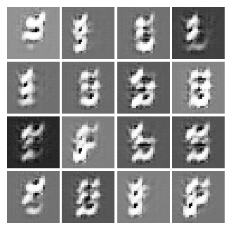|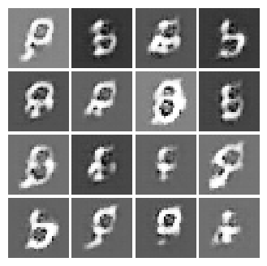|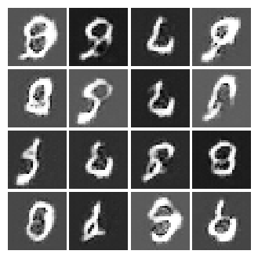|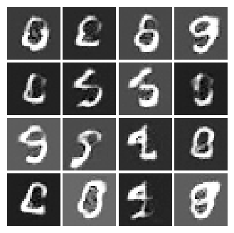|

## Conditional GAN(DCGAN)
|0回学習|1000回学習|5000回学習|10000回学習|30000回学習|50000回学習|
|:--:|:--:|:--:|:--:|:--:|:--:|
|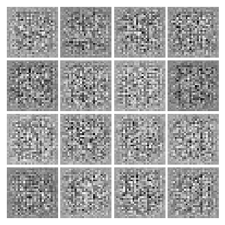|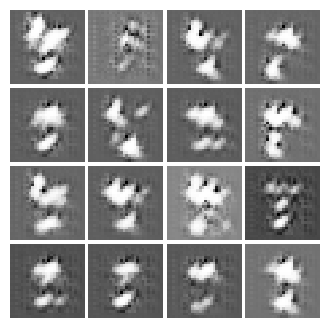|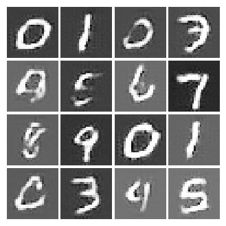|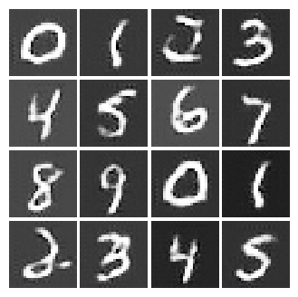|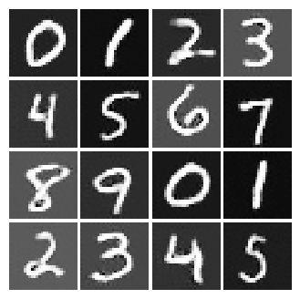|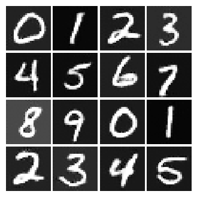|