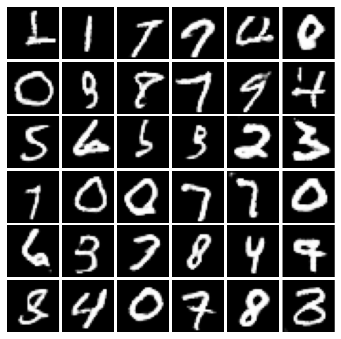

Generative Adversarial Network
--
# vanilla GAN(GAN)
```bash
$ python train.py --network GAN --opt Adam 
```

# DCGAN
```bash
$ python train.py --network DCGAN --opt Adam 
```


# LSGAN
```bash
$ python train.py --network LSGAN --opt Adam 
```

# Wasserstein GAN(WGAN)
```bash
$ python train.py --network WGAN --opt RMSprop --n_disc_update 5 --lr 0.00005
```

# WGAN-GP  
```bash
$ python train.py --network WGANGP --opt RMSprop --n_disc_update 5 --lr 0.00005
```

# Conditional GAN(CGAN)
- 各GANを実行する際に```--conditional```を追加するとconditional GANになる

# ACGAN