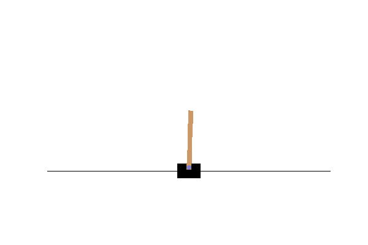
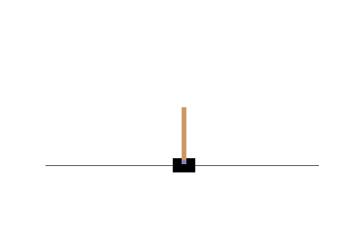
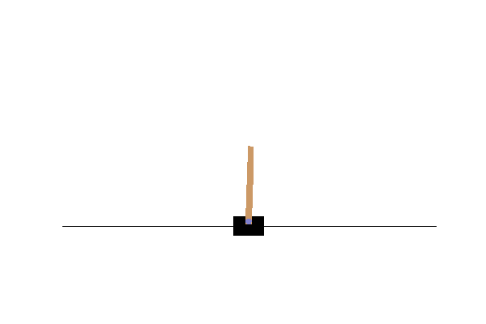
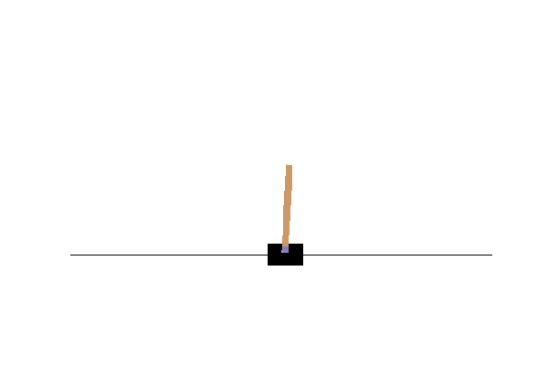
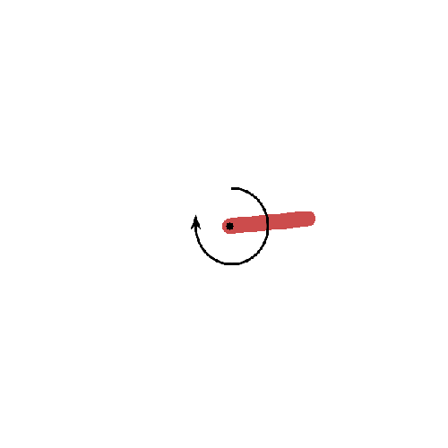
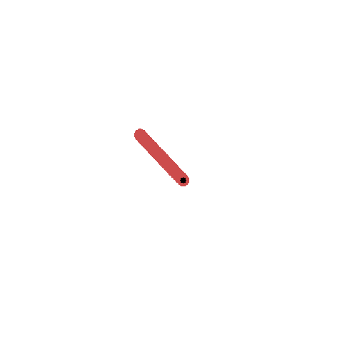
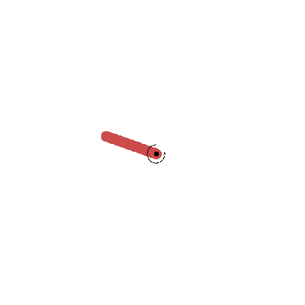
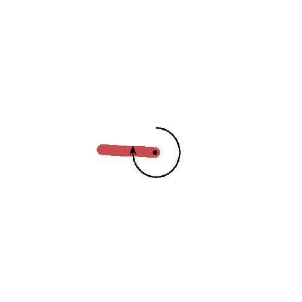

Classic Control
====

# Overview
tensorflowで強化学習を学ぶ用  

# Description
- OpenAI gymを用いて強化学習を行う
- mujocoのライセンスは未取得のため、使えない
- pygame_wrapperでPixelCopter-v0を行う場合は、```src/ple/ple/__init__.py```と```src/ple/ple/pixelcopter.py```内のクラス名を変更する必要があるため注意

# Usage
## cartpole
```bash
python hogehoge_wrpper.py --env (environment名) \
                          --n_episode (episode数) \
                          --step (step数) \
                          --batch_size (batchサイズ) \
                          --n_warmup (warmupまでの回数) \
                          --model_update (modelを更新する間隔) \
                          --render (renderするかどうか) \
                          --lr (learning rate) \
                          --opt (optimizer)
```

# Result
## cartpole_wrapper
|Agent|100回学習|150回学習|
|:--:|:--:|:--:|
|DQN|||
|DDQN|||
|DQN + Dueling|||
|DDQN + Dueling|||
## Pendulum
|Agent|100回学習|150回学習|
|:--:|:--:|:--:|
|DDPG|||
|TD3|||

## Half Cheetah
|Agent|0回学習|200回学習|
|:--:|:--:|:--:|
|DDPG+PER+multi_step|||