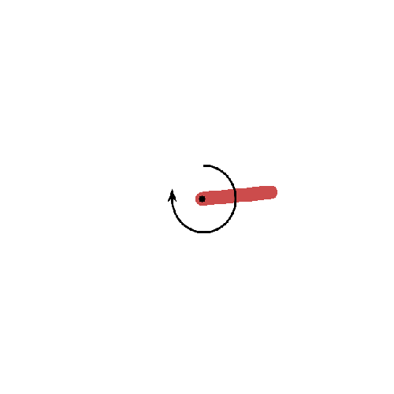

Classic Control
====

# Overview
tensorflowで強化学習を学ぶ用  

# Description
- OpenAI gymを用いて強化学習を行う
- mujocoのライセンスは未取得のため、使えない
- pygame_wrapperでPixelCopter-v0を行う場合は、```src/ple/ple/__init__.py```と```src/ple/ple/pixelcopter.py```内のクラス名を変更する必要があるため注意

# Usage
## cartpole
```bash
python hogehoge_wrpper.py --env (environment名) \
                          --n_episode (episode数) \
                          --step (step数) \
                          --batch_size (batchサイズ) \
                          --n_warmup (warmupまでの回数) \
                          --model_update (modelを更新する間隔) \
                          --render (renderするかどうか) \
                          --lr (learning rate) \
                          --opt (optimizer)
```

# Result
## cartpole_wrapper
### DQN
### DDQN
### DQN + Dueling
### DDQN + Dueling
## continuous_wrapper
### DDPG
|50回学習|100回学習|
|:--:|:--:|
|||
### TD3
|50回学習|100回学習|
|:--:|:--:|
|||
